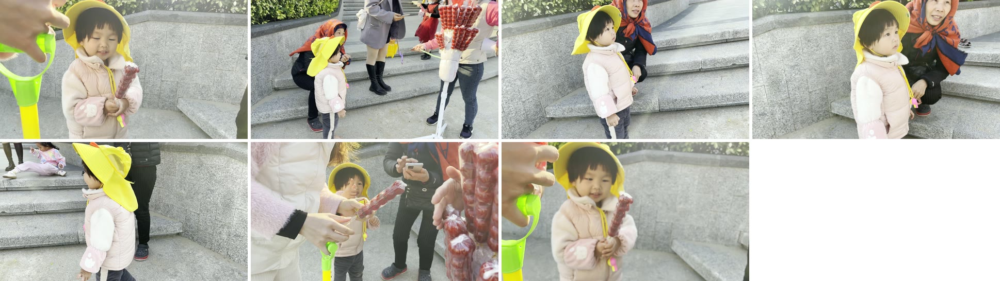

# 镜头组接技能包 · Shot Transition Skills

> 把一位视频创作者公开分享的**镜头组接方法论**，蒸馏成 **6 个可执行的 Agent Skill**，
> 并配上一整套**在成片上验证结论**的量化工具。
>
> 不是"讲道理"的教程，而是**跑过真实项目、有实测数据**的工程化产物。

[](LICENSE)
[](LICENSE-CONTENT.md)
[](skills/)

---

## 先看成果

案例是**真实剪辑项目**，成片与实测数据都在仓库里。

### 案例 01 · 家庭出游 17s 横版短片

[](cases/01-shot-transition-17s/README.md)

`7 镜头 / 17.02s / 3840×2160 / 60fps`

用 6 个 skill 走完一次完整剪辑：审计发现 **2 处违规**（同场景方向相反、节奏均匀单调）→ 修复 → 复检通过。

[▶ 看小样](cases/01-shot-transition-17s/demo-720p.mp4) · [案例详情](cases/01-shot-transition-17s/README.md) · [逐镜拉片教程](tutorial/lapian-tutorial.html)

---

## 这个仓库的核心主张：结论必须来自最终产物

案例 01 的审计没有停在"源素材看起来还行"——它直接对**导出的成片**做光流方向分析，
逐条对照 6 个 skill，结果查出 **2 处真违规**（同场景方向相反、活跃场景节奏单调），
这两处光靠肉眼回看很难发现。修复后复测，两项才真正达标。

所以本仓库有一条铁律：

> **任何"匹配 / 一致 / 达标"类结论，都必须在导出的成片上重算一遍。**
> 代理指标（源素材取样窗口、低分辨率代理片、缩略图目视）**只能用于选材阶段**，不能用于下结论。

这条规矩不是口号：`tools/` 里每个验收脚本都直接读**成片文件**，案例报告里的每个数字都标注了量法。

---

## 6 个 Skill

每个 skill 采用 **R-I-C-E 四段骨架**，各含 `SKILL.md` + `test-prompts.json` + `test-results.md`。

| Skill | 解决什么问题 |
|---|---|
| [`shot-composition-spatial-rules`](skills/shot-composition-spatial-rules/SKILL.md) | 空间规则：30° 原则 / 180° 原则 / 越轴 |
| [`visual-variation-judgment`](skills/visual-variation-judgment/SKILL.md) | 视觉变量判断：动接动、静接近 |
| [`transition-matching-dual-dimension`](skills/transition-matching-dual-dimension/SKILL.md) | 转场匹配双维度：速度 + 方向 |
| [`shot-duration-decision`](skills/shot-duration-decision/SKILL.md) | 镜头时长决策：三层面框架 |
| [`momentum-receive-cutting`](skills/momentum-receive-cutting/SKILL.md) | 出势接作：剪辑点选在哪一帧 |
| [`cut-trace-dual-strategy`](skills/cut-trace-dual-strategy/SKILL.md) | 剪辑痕迹双策略：弱化 vs 利用（元策略） |

**关系**：`cut-trace-dual-strategy` 是入口元策略，先决定"弱化痕迹"还是"利用跳切"；
其余 5 个在既定路线下解决具体判据。完整关系图见 [`docs/INDEX.md`](docs/INDEX.md)。

> 方法论总览 → [`docs/METHOD.md`](docs/METHOD.md) · 术语表 → [`docs/GLOSSARY.md`](docs/GLOSSARY.md) · 精华长文 → [`docs/DIGEST.md`](docs/DIGEST.md)

---

## 工具链

这些脚本**真实跑过**上面的案例，覆盖"选镜 → 渲染 → 成片验收"全链路。

```bash
# 选镜阶段
python tools/scan_profile.py  <source.mov>        # 全片 6fps 光流扫描
python tools/select_shots.py                      # 硬约束 DP 选镜

# 渲染（帧/样本精确截断 + 切点 8ms 音频淡变）
.\tools\render_hardcut.ps1 -Source <src> -Out <out.mp4> `
                           -Starts 3.0,67.0,... -Durations 7,4,3,3,3,6,7

# 成片验收（全部直接读成片）
python tools/measure_cut.py       <final.mp4>     # 逐镜速度差
python tools/measure_boundary.py  <final.mp4>     # 剪辑点两侧方向
python tools/cut_profile.py       <final.mp4>     # 硬切 vs 叠化
python tools/cut_diff.py          <final.mp4>     # 跳切风险
python tools/audio_cut_check.py   <final.mp4>     # 音频咔哒声
python tools/verify_delivery.py   <final.mp4> <source.mov>   # 规格总检
```

依赖 FFmpeg + Python(numpy, opencv-python)。详细用法、阈值判读见 [`tools/README.md`](tools/README.md)。

---

## 快速开始

### 用 Skill（推荐）

把 `skills/` 下的目录复制到你的 Agent skills 目录即可：

```bash
cp -r skills/* <your-agent-skills-dir>/
```

每个 skill 目录含 `SKILL.md`（四段骨架）、`test-prompts.json`（8 个压力测试用例）、
`test-results.md`（测试记录）。

### 复现案例

1. 按 [`tools/README.md`](tools/README.md) 配好 FFmpeg 与 Python 依赖
2. `scan_profile.py` 扫源片 → `select_shots.py` 选镜 → `render_hardcut.ps1` 渲染
3. 用 6 个验收脚本复核成片，对照案例报告里的实测表

---

## 目录结构

```
.
├── README.md                  # 本文件
├── LICENSE                    # 代码：MIT
├── LICENSE-CONTENT.md         # 内容：CC BY 4.0
├── ATTRIBUTION.md             # 出处与授权说明（重要）
├── CONTRIBUTING.md            # 贡献指南（含"铁律"）
├── CODE_OF_CONDUCT.md
├── CHANGELOG.md
├── skills/                    # 6 个技能（权威版本）
├── docs/                      # 方法论 / 术语表 / 索引 / 精华长文
├── cases/                     # 真实案例（成片小样 + 报告 + 实测数据）
├── tools/                     # 可复现的验收脚本
└── tutorial/                  # 17s 成片逐镜拉片教程（HTML）
```

---

## 授权与出处

本仓库采用**双许可**：

| 范围 | 许可 |
|---|---|
| 代码（`tools/` 下 `*.py` / `*.ps1` / `*.json`） | [MIT](LICENSE) |
| 文档与内容（`skills/` / `docs/` / `cases/` / `tutorial/`） | [CC BY 4.0](LICENSE-CONTENT.md) |

**方法论来源**：6 个技能是把 **老登的视频日记**（B站）公开分享的剪辑方法论学习、结构化并工程化的结果。
本项目与原作者无隶属关系，也不是官方整理版本，方法论知识产权归原作者所有。
**因版权原因，本仓库不收录第三方原片、音轨与转写稿**，只保留出处与时间戳。
详见 [`ATTRIBUTION.md`](ATTRIBUTION.md)。

**案例素材**：案例源素材均为本人自拍自有素材；4K 原片体积过大，**不随仓库分发**，
仓库内只保留 720p 展示小样。

---

## 贡献

欢迎贡献新的 skill、案例或工具。**先读 [`CONTRIBUTING.md`](CONTRIBUTING.md) 里的铁律**——
我们不接受"看起来对"的结论。