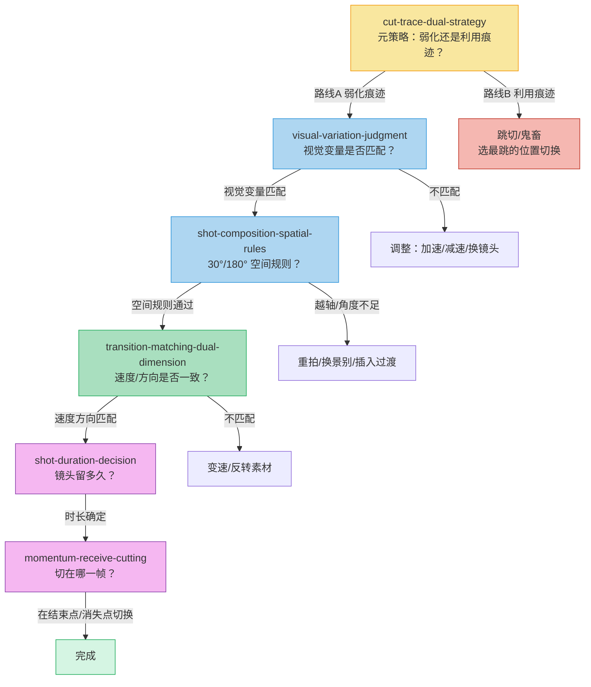
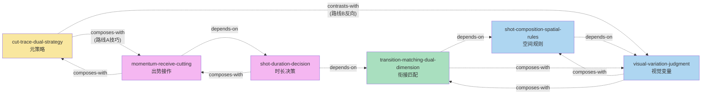

# 镜头组接逻辑 — Skill 索引

> 来源: 老登的视频日记《0基础保姆级教程，13分钟彻底学会镜头组接逻辑！》
> 蒸馏时间: 2026-09-20
> Skill 总数: 6 | 验证: V1✓ V2✓ V3✓ (全部通过)

---

## Skill 一览

| # | Skill | 层级 | 核心问题 | 视频时间戳 |
|---|---|---|---|---|
| 1 | [visual-variation-judgment](visual-variation-judgment/SKILL.md) | 基础层 | 两个镜头的视觉变化量配不配？ | 00:03:08 |
| 2 | [shot-composition-spatial-rules](shot-composition-spatial-rules/SKILL.md) | 基础层 | 机位角度够不够、方向对不对？ | 00:00:16 |
| 3 | [transition-matching-dual-dimension](transition-matching-dual-dimension/SKILL.md) | 优化层 | 速度和方向是否一致？ | 00:04:15 |
| 4 | [shot-duration-decision](shot-duration-decision/SKILL.md) | 时长层 | 这个镜头该留多久？ | 00:05:39 |
| 5 | [momentum-receive-cutting](momentum-receive-cutting/SKILL.md) | 剪辑点层 | 在哪一帧切换最合适？ | 00:10:03 |
| 6 | [cut-trace-dual-strategy](cut-trace-dual-strategy/SKILL.md) | 元策略层 | 弱化痕迹还是利用痕迹？ | 00:12:38 |

---

## 剪辑决策流程

剪辑一段视频时，6 个 skill 按以下顺序逐层介入：

**层级说明**:
- **元策略层** (黄): 决定整体路线 — 弱化痕迹（叙事流畅）还是利用痕迹（跳切/鬼畜）
- **基础层** (蓝): 判断两个镜头能不能接 — 视觉变量 + 空间规则
- **优化层** (绿): 让衔接更顺 — 速度/方向匹配
- **时长层** (紫): 决定每个镜头多长 — 信息/情绪/节奏三层面
- **剪辑点层** (紫): 精确到帧 — 出势接作，在结束点/消失点切换

---

## Skill 关系图

**关系类型**:
- `depends-on` (实线箭头 →): A depends-on B = 必须先完成 B 才能用 A
- `composes-with` (虚线): A composes-with B = 两者配合使用形成完整方案
- `contrasts-with` (虚线): A contrasts-with B = 两者是互斥的替代路线

---

## 关系矩阵

| Skill ↓ depends-on → | S01 | S02 | S03 | S04 | S05 | S06 |
|---|---|---|---|---|---|---|
| **S01 visual-variation** | — | — | — | — | — | — |
| **S02 spatial-rules** | ✓ | — | — | — | — | — |
| **S03 dual-dimension** | — | ✓ | — | — | — | — |
| **S04 duration** | — | — | ✓ | — | — | — |
| **S05 momentum-cut** | — | — | — | ✓ | — | — |
| **S06 cut-trace** | — | — | — | — | — | — |

| Skill ↓ composes-with → | S01 | S02 | S03 | S04 | S05 | S06 |
|---|---|---|---|---|---|---|
| **S01 visual-variation** | — | ✓ | ✓ | — | — | — |
| **S02 spatial-rules** | ✓ | — | ✓ | — | — | — |
| **S03 dual-dimension** | ✓ | ✓ | — | — | — | — |
| **S04 duration** | — | — | — | — | ✓ | — |
| **S05 momentum-cut** | — | — | — | ✓ | — | ✓ |
| **S06 cut-trace** | — | — | — | — | ✓ | — |

| Skill ↓ contrasts-with → | S01 | S02 | S03 | S04 | S05 | S06 |
|---|---|---|---|---|---|---|
| **S01 visual-variation** | — | — | — | — | — | ✓ |
| **S06 cut-trace** | ✓ | — | — | — | ✓ | — |

---

## 快速查找

| 用户问题 | 推荐 Skill |
|---|---|
| "两个镜头接在一起为什么跳" | S01 → S02 → S03 (依次排查) |
| "动接动静接近怎么判断" | S01 |
| "越轴是什么""30度原则" | S02 |
| "速度匹配""方向匹配" | S03 |
| "镜头该留多久""时长怎么定" | S04 |
| "切在哪一帧""剪辑点怎么选" | S05 |
| "要不要用跳切""怎么让剪辑更丝滑" | S06 |
| "跳切什么时候用" | S06 (路线B) |
| "怎么让剪辑更丝滑" | S06 (路线A) → S05 |
